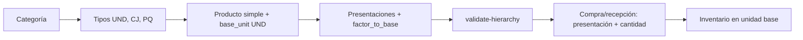

# Guía API — Catálogo maestro

Documentación operativa del módulo **Catalog** (Fase 3): categorías, unidades de medida, productos, presentaciones de empaque, kits/BOM, proveedores e importaciones masivas.

**Base URL:** `http://localhost:8080/api` (desarrollo Docker)  
**Prefijo de recursos:** `/api/v1/...`  
**Autenticación:** Bearer token (Laravel Sanctum) en todas las rutas del catálogo.

---

## Tabla de contenido

1. [Autenticación y permisos](#1-autenticación-y-permisos)
2. [Formato de respuestas y errores](#2-formato-de-respuestas-y-errores)
3. [Modelo de dominio](#3-modelo-de-dominio)
4. [Categorías](#4-categorías)
5. [Unidades de medida](#5-unidades-de-medida)
6. [Productos](#6-productos)
7. [Presentaciones de producto](#7-presentaciones-de-producto)
8. [Productos compuestos (kits / BOM)](#8-productos-compuestos-kits--bom)
9. [Proveedores](#9-proveedores)
10. [Importaciones masivas](#10-importaciones-masivas)
11. [Flujos recomendados](#11-flujos-recomendados)
12. [Integración con inventario](#12-integración-con-inventario)
13. [Referencias](#13-referencias)

---

## 1. Autenticación y permisos

### Obtener token

```http
POST /api/v1/auth/login
Content-Type: application/json

{
  "email": "admin@sga.bojanini.com",
  "password": "password"
}
```

Respuesta exitosa (200): incluye `data.token`. Usar en el resto de peticiones:

```http
Authorization: Bearer {token}
Accept: application/json
Content-Type: application/json
```

### Middleware aplicado

| Middleware | Efecto |
|------------|--------|
| `auth:sanctum` | Requiere token válido (401 si falta o expiró) |
| `user.is_active` | Usuario desactivado → rechazo |
| `permission:{nombre}` | Permiso Spatie requerido por ruta (403) |

### Permisos del catálogo

| Recurso | Ver | Crear | Editar | Eliminar | Importar |
|---------|-----|-------|--------|----------|----------|
| Categorías / productos / unidades | `productos.ver` | `productos.crear` | `productos.editar` | `productos.eliminar` | `productos.importar` |
| Proveedores | `proveedores.ver` | `proveedores.crear` | `proveedores.editar` | `proveedores.eliminar` | `proveedores.importar` |
| Disponibilidad de kit | `stock.ver` | — | — | — | — |

> El rol **admin** del seeder incluye todos los permisos anteriores.

---

## 2. Formato de respuestas y errores

### Respuesta exitosa

```json
{
  "success": true,
  "message": "Texto descriptivo",
  "data": { }
}
```

- **201 Created:** creación (`POST` que persiste un recurso).
- **200 OK:** lectura, actualización y eliminaciones lógicas (el cuerpo de delete no incluye `data`).

Eliminación (soft delete):

```json
{
  "success": true,
  "message": "Producto eliminado"
}
```

### Errores (implementación actual)

| HTTP | Cuándo | Cuerpo típico |
|------|--------|----------------|
| **401** | Sin token o token inválido | `{ "success": false, "message": "No autenticado. Envía un token válido..." }` |
| **403** | Sin permiso | `{ "success": false, "message": "No tienes permiso para realizar esta acción." }` |
| **404** | Recurso no encontrado (ruta o ID) | `{ "success": false, "message": "Recurso no encontrado." }` o mensaje del controlador |
| **405** | Método HTTP incorrecto | `{ "success": false, "message": "Método HTTP no permitido..." }` |
| **409** | Regla de negocio (`DomainException`) | `{ "success": false, "message": "..." }` — p. ej. código duplicado vía dominio |
| **422** | Validación Laravel o regla en controlador | `{ "success": false, "message": "Error de validación.", "errors": { "campo": ["..."] } }` |
| **429** | Rate limit | `{ "success": false, "message": "Demasiadas peticiones..." }` |
| **500** | Error no controlado | `{ "success": false, "message": "..." }` (detalle solo si `APP_DEBUG=true`) |

**Validación (422):** el objeto de errores está en la raíz como `errors`, no dentro de `error.details` (el plan documenta un formato más elaborado; la API actual es el de arriba).

**Errores del controlador** (`ApiResponse::error`): solo `success` y `message`, sin `errors` anidado.

Ejemplo — código de producto duplicado al crear:

```http
POST /api/v1/products
→ 422

{
  "success": false,
  "message": "Error de validación.",
  "errors": {
    "code": ["Ya existe un producto con este código."]
  }
}
```

### Fechas

En recursos que las exponen: ISO 8601 con offset, p. ej. `2026-05-17T14:30:00-05:00` (`America/Bogota`).

### Listados y paginación

Los listados del catálogo (**productos, categorías, proveedores, unidades**) devuelven hoy un **array completo** en `data` (sin `meta` ni `links`). Los query params de filtro sí aplican donde el repositorio los implementa.

| Parámetro | Uso en catálogo |
|-----------|-----------------|
| `search` | Texto en nombre, código (y SKU en productos) |
| `category_id` | Solo productos |
| `product_type` | `simple` o `kit` |
| `is_active` | Categorías, productos, proveedores, unidades |
| `parent_id` | Categorías |
| `is_base` | Unidades de medida |

---

## 3. Modelo de dominio

### Tipos de producto (`product_type`)

| Valor | Descripción |
|-------|-------------|
| `simple` | Insumo individual. Tiene lotes, stock FEFO y **presentaciones** de empaque. |
| `kit` | Producto compuesto (BOM). Stock físico solo en **componentes**; no usa presentaciones en v1. |

### Tres conceptos que el front debe distinguir

| Concepto | Dónde vive | Para qué sirve |
|----------|------------|----------------|
| **Unidad de medida** (`units_of_measure`) | Catálogo global: `UND`, `CJ`, `PQ`… | Etiqueta del **tipo** de empaque o de la unidad mínima. **No convierte** cantidades por sí sola. |
| **Unidad base del producto** (`products.base_unit_id`) | Por producto | Unidad en la que **siempre** se guarda inventario, lotes, FEFO y consumos (ej. 1 aguja). |
| **Presentación** (`product_presentations`) | Por producto `simple` | Nivel de empaque con **`factor_to_base`**: cuántas unidades base trae **1** unidad de ese nivel. Aquí está la **conversión automática**. |

> **Regla para el front:** en compras, recepción y entradas manuales el usuario elige **presentación + cantidad**; el backend (o `convert-to-base`) obtiene la cantidad en base. **No multipliques en el cliente** salvo para vista previa; usa los endpoints del catálogo.

**Fórmula única:**

```text
quantity_base = quantity × factor_to_base   (de la presentación elegida)
```

### Presentaciones vs kits

| | Presentaciones | Kit (BOM) |
|---|----------------|-----------|
| Agrupa | Niveles de empaque del **mismo** producto | Varios productos **distintos** |
| Stock | Un producto; todo se convierte a unidad base | Solo en componentes |
| Uso | Compras y recepción | Consumo/salida como un ítem lógico |
| Conversión | `factor_to_base` por presentación | `quantity_per_kit` × cantidad de kits (explosión) |

### Unidad base e inventario

- **Consultas de stock, alertas, consumos y salidas** → siempre números en unidad base.
- **Pantallas de compra/recepción** → el operador ve cajas/paquetes; al guardar se envía `presentation_id` + cantidad y el sistema persiste en base.

Ejemplos rápidos (aguja, presentación paquete `factor_to_base: 100`):

| El operador registra | Cálculo (backend) | Inventario |
|----------------------|-------------------|------------|
| 1 paquete | 1 × 100 | +100 unidades base |
| 2 paquetes | 2 × 100 | +200 unidades base |
| 1 caja con `factor_to_base: 1000` | 1 × 1000 | +1000 unidades base |
| 10 paquetes (factor 100) | 10 × 100 | +1000 unidades base |

### Jerarquía de empaques compuestos (ejemplo seed `AGU-21G`)

Una **caja** no se define solo con la unidad `CJ` del catálogo: se define una **presentación** que enlaza producto + unidad `CJ` + factores.

```text
Caja Maestra (CJ-M5000)     factor_to_base: 5000   level 1   (raíz, compra al proveedor)
  └── Caja x500 (CJ-500)    factor_to_base: 500    level 2   quantity_per_parent: 10  → 10 cajas por maestra
        └── Paquete (PQ-100) factor_to_base: 100   level 3   quantity_per_parent: 5   → 5 paquetes por caja
```

Coherencia entre niveles: `factor_to_base (padre) = quantity_per_parent (hijo) × factor_to_base (hijo)`  
→ 10 × 500 = 5000 ✓ · 5 × 100 = 500 ✓

Detalle de API y pantallas: [§5 Unidades de medida](#5-unidades-de-medida) y [§7 Presentaciones](#7-presentaciones-de-producto).

### Kit — disponibilidad

En un almacén:

`kits_disponibles = min( floor(stock_componente_i / quantity_per_kit_i) )`

Endpoint dedicado: `GET .../kit-availability?warehouse_id=`.

### Kit — explosión

Dado un kit y `quantity_kits`, devuelve líneas con cantidad en unidad base por componente:

`quantity_base = quantity_per_kit × quantity_kits`

La salida/consumo real en inventario aplica explosión automáticamente al usar el `product_id` del kit (Fase 4).

---

## 4. Categorías

Rutas en `routes/api/catalog.php`. Árbol jerárquico padre → hijos.

| Método | Ruta | Permiso |
|--------|------|---------|
| GET | `/api/v1/categories` | `productos.ver` |
| POST | `/api/v1/categories` | `productos.crear` |
| GET | `/api/v1/categories/{id}` | `productos.ver` |
| PUT | `/api/v1/categories/{id}` | `productos.editar` |
| DELETE | `/api/v1/categories/{id}` | `productos.eliminar` |
| GET | `/api/v1/categories-tree` | `productos.ver` |

### Crear / actualizar — body

| Campo | Tipo | Reglas |
|-------|------|--------|
| `parent_id` | int \| null | Opcional; debe existir en `categories` |
| `name` | string | Requerido, máx. 255 |
| `code` | string | Requerido, máx. 50, único |
| `description` | string | Opcional |

```json
{
  "parent_id": null,
  "name": "Insumos Médicos",
  "code": "INS-MED",
  "description": "Categoría raíz"
}
```

### Respuesta (recurso)

```json
{
  "success": true,
  "message": "Categoría creada exitosamente",
  "data": {
    "id": 1,
    "parent_id": null,
    "name": "Insumos Médicos",
    "code": "INS-MED",
    "description": null,
    "is_active": true
  }
}
```

`GET /categories-tree` devuelve categorías raíz con `children` anidados recursivamente.

### Filtros listado

`?parent_id=1&is_active=true&search=insumo`

---

## 5. Unidades de medida

Catálogo **maestro de tipos** de unidad/empaque. Sirve para nombrar y clasificar; **la conversión numérica a inventario no ocurre aquí**, sino en las **presentaciones** del producto ([§7](#7-presentaciones-de-producto)) mediante `factor_to_base`.

### Qué hace y qué no hace este módulo

| Sí | No |
|----|-----|
| Listar/crear tipos reutilizables: Unidad, Caja, Paquete, Kit, ml… | Definir “esta caja trae 10 paquetes de 100” (eso es **presentación** por producto) |
| Asignar `base_unit_id` al crear un producto | Calcular stock al recibir mercancía |
| Marcar tipos que **pueden** ser unidad base de un producto (`is_base: true`) | Sustituir `factor_to_base` |

### Relación con producto y presentaciones

```text
units_of_measure (UND, CJ, PQ…)     ← catálogo global, este endpoint
        │
        ├─► products.base_unit_id     ← unidad MÍNIMA de control del producto (inventario)
        │
        └─► product_presentations.units_of_measure_id
                    +
                factor_to_base        ← CUÁNTAS unidades base trae 1 unidad de ESE empaque
                quantity_per_parent   ← cuántos hijos caben en 1 padre (jerarquía)
```

**Ejemplo aguja:** `base_unit_id` → `UND` (1 aguja). Presentación “Paquete x100” usa `units_of_measure_id` → `PQ` y `factor_to_base: 100`. Recibir **1 paquete** → el sistema carga **100** `UND` en inventario sin que el front calcule 1×100.

### Endpoints

| Método | Ruta | Permiso |
|--------|------|---------|
| GET | `/api/v1/units-of-measure` | `productos.ver` |
| POST | `/api/v1/units-of-measure` | `productos.crear` |
| GET | `/api/v1/units-of-measure/{id}` | `productos.ver` |
| PUT | `/api/v1/units-of-measure/{id}` | `productos.editar` |
| DELETE | `/api/v1/units-of-measure/{id}` | `productos.eliminar` |

> No hay DELETE físico: el caso de uso desactiva la unidad (`is_active = false`).

Filtros en listado: `?is_active=true&is_base=true&search=caja`

### Crear / actualizar — body

| Campo | Tipo | Reglas |
|-------|------|--------|
| `name` | string | Requerido, máx. 100 |
| `abbreviation` | string | Requerido, máx. 10, único (ej. `UND`, `KIT`, `CJ`, `PQ`) |
| `is_base` | boolean | Opcional. `true` si el tipo puede ser **unidad base** de un producto (Unidad, ml, Kit lógico…). `CJ`/`PQ` suelen ser `false` y usarse solo en presentaciones. |

Unidades típicas del seeder:

| Abreviatura | Uso típico | `is_base` en seed |
|-------------|------------|-------------------|
| `UND` | Unidad mínima (aguja, gasa, pieza) | `true` |
| `KIT` | Unidad base de un producto compuesto | `true` |
| `CJ` | Etiqueta “caja” en una presentación | `false` |
| `PQ` | Etiqueta “paquete” en una presentación | `false` |

### Guía rápida para el front

1. **Pantalla “Unidades de medida”** — CRUD de tipos globales; no pedir factores de conversión aquí.
2. **Alta de producto** — Selector de **unidad base** (`base_unit_id`): solo unidades con `is_base: true` (o las que definan negocio).
3. **Empaques del producto** — Tras crear el producto `simple`, ir a presentaciones ([§7](#7-presentaciones-de-producto)): ahí se arma caja/paquete con `factor_to_base`.
4. **Compra / recepción / entrada** — Combo de **presentaciones del producto** (no solo unidades globales) + cantidad. Vista previa opcional llamando a `POST /presentations/convert-to-base` antes de confirmar.
5. **Stock y movimientos** — Mostrar cantidades en **unidad base**; opcionalmente mostrar equivalencia legible (“200 und ≈ 2 paq”) usando `factor_to_base` del catálogo ya cargado.

```http
POST /api/v1/presentations/convert-to-base
{ "presentation_id": 3, "quantity": 2 }
→ { "quantity_base": 200 }
```

6. **No confundir** unidad `CJ` del catálogo con “una caja de este producto”: hasta que exista una **presentación** con `factor_to_base`, el sistema no sabe cuántas unidades base tiene esa caja.

---

## 6. Productos

| Método | Ruta | Permiso |
|--------|------|---------|
| GET | `/api/v1/products` | `productos.ver` |
| POST | `/api/v1/products` | `productos.crear` |
| GET | `/api/v1/products/{id}` | `productos.ver` |
| PUT | `/api/v1/products/{id}` | `productos.editar` |
| DELETE | `/api/v1/products/{id}` | `productos.eliminar` |

### Crear producto simple

```http
POST /api/v1/products
```

```json
{
  "category_id": 1,
  "base_unit_id": 1,
  "product_type": "simple",
  "name": "Producto Test",
  "code": "PRD-TEST-001",
  "sku": null,
  "description": "Opcional",
  "requires_cold_chain": false,
  "reorder_point": 50,
  "reorder_quantity": 100,
  "min_stock": 20,
  "max_stock": 500
}
```

| Campo | Reglas |
|-------|--------|
| `category_id` | Requerido, existe en `categories` |
| `base_unit_id` | Requerido. Unidad **mínima** de inventario (FK a `units_of_measure`, ej. `UND`). Los empaques mayores se configuran después en [presentaciones](#7-presentaciones-de-producto). |
| `product_type` | `simple` (default) o `kit` |
| `components` | Requerido si `product_type` es `kit` (ver sección 8) |
| `name` | Requerido |
| `code` | Requerido, único, máx. 50 |
| `sku` | Opcional, único |
| `reorder_*`, `min_stock`, `max_stock` | Enteros ≥ 0 |

**201 Created** — `data` sin relaciones anidadas:

```json
{
  "id": 10,
  "category_id": 1,
  "base_unit_id": 1,
  "product_type": "simple",
  "name": "Producto Test",
  "code": "PRD-TEST-001",
  "sku": null,
  "description": null,
  "requires_cold_chain": false,
  "reorder_point": 0,
  "reorder_quantity": 0,
  "min_stock": 0,
  "max_stock": 0,
  "is_active": true
}
```

### Detalle (`GET /products/{id}`)

Incluye relaciones cuando existen:

```json
{
  "success": true,
  "message": "Detalle del producto",
  "data": {
    "id": 3,
    "name": "Paquete cirugía básica",
    "code": "KIT-CIR-BAS",
    "sku": null,
    "description": "Kit de insumos para cirugía menor",
    "product_type": "kit",
    "requires_cold_chain": false,
    "reorder_point": 0,
    "reorder_quantity": 0,
    "min_stock": 0,
    "max_stock": 0,
    "is_active": true,
    "category": { "id": 1, "name": "Insumos Médicos", "code": "INS-MED" },
    "base_unit": { "id": 2, "name": "Kit", "abbreviation": "KIT" },
    "components": [
      {
        "id": 1,
        "component_product_id": 2,
        "quantity_per_kit": 5,
        "sort_order": 1,
        "component": { "id": 2, "name": "Gasa estéril 10x10", "code": "GAS-10X10" }
      },
      {
        "id": 2,
        "component_product_id": 1,
        "quantity_per_kit": 10,
        "sort_order": 2,
        "component": { "id": 1, "name": "Aguja 21G", "code": "AGU-21G" }
      }
    ],
    "created_at": "2026-01-15T10:00:00-05:00"
  }
}
```

### Actualizar

`PUT /api/v1/products/{id}` — mismos campos que crear (sin `components` en el request de update; la receta se gestiona por endpoints de kit).

### Eliminar

`DELETE /api/v1/products/{id}` — soft delete.

### Filtros listado

```
GET /api/v1/products?search=aguja&category_id=1&product_type=simple&is_active=1
```

---

## 7. Presentaciones de producto

Aquí se modelan los **empaques compuestos** (caja que contiene paquetes, paquete que contiene unidades) y el **`factor_to_base`** que permite pasar a unidad base **sin cálculos manuales** en el front.

Solo productos **`simple`**. Los kits no deben tener presentaciones en v1.

### Campos clave (conversión y jerarquía)

| Campo | Significado | Ejemplo aguja |
|-------|-------------|---------------|
| `factor_to_base` | Unidades base en **1** unidad de **este** nivel de empaque | 1 paquete → `100` agujas |
| `quantity_per_parent` | Cuántas unidades de **este** nivel hay en **1** unidad del padre | 5 paquetes por caja |
| `parent_id` / `level` | Árbol de empaques (1 = más externo, ej. caja maestra) | Maestra → Caja → Paquete |
| `units_of_measure_id` | Tipo de empaque (`CJ`, `PQ`) desde [§5](#5-unidades-de-medida) | Paquete usa `PQ` |
| `is_purchase_default` | Presentación sugerida al crear OC / recepción | `PQ-100` |

**Coherencia obligatoria** (validar con `validate-hierarchy` antes de guardar):

```text
factor_to_base (padre) = quantity_per_parent (hijo) × factor_to_base (hijo)
```

### Escenarios que debe soportar el front

| Operación del usuario | Qué enviar | Resultado en inventario |
|------------------------|------------|-------------------------|
| Llegan 3 paquetes de 100 | `presentation_id` del paquete, `quantity: 3` | +300 base (`3 × 100`) |
| Llega 1 caja (= 10 paq × 100) | Presentación “caja” con `factor_to_base: 1000`, `quantity: 1` | +1000 base |
| Alternativa misma caja | Presentación paquete, `quantity: 10` | +1000 base (`10 × 100`) |
| Vista previa antes de guardar | `POST .../convert-to-base` | Muestra `quantity_base` al operador |

El sistema **no infiere** la estructura: primero se cargan las presentaciones en catálogo; luego compras/recepción/inventario usan `presentation_id` + cantidad.

### Endpoints

| Método | Ruta | Permiso |
|--------|------|---------|
| GET | `/api/v1/products/{productId}/presentations` | `productos.ver` |
| GET | `/api/v1/products/{productId}/presentations/tree` | `productos.ver` |
| POST | `/api/v1/products/{productId}/presentations` | `productos.editar` |
| PUT | `/api/v1/presentations/{id}` | `productos.editar` |
| DELETE | `/api/v1/presentations/{id}` | `productos.eliminar` |
| POST | `/api/v1/presentations/validate-hierarchy` | `productos.ver` |
| POST | `/api/v1/presentations/convert-to-base` | `productos.ver` |

### Crear presentación

```json
{
  "parent_id": 2,
  "name": "Paquete x100",
  "code": "PQ-100",
  "units_of_measure_id": 4,
  "quantity_per_parent": 5,
  "factor_to_base": 100,
  "level": 3,
  "is_purchase_default": true,
  "sort_order": 3
}
```

| Campo | Reglas |
|-------|--------|
| `parent_id` | Opcional; si es raíz, `level` debe ser 1 |
| `name`, `code` | Requeridos |
| `units_of_measure_id` | Requerido; tipo de empaque ([§5](#5-unidades-de-medida)) |
| `factor_to_base` | **Requerido**, entero ≥ 1. Total de unidades base en 1 unidad de este nivel. |
| `level` | Requerido, ≥ 1; hijo = `padre.level + 1` |
| `quantity_per_parent` | Si tiene padre: cuántos de este nivel van en 1 del padre; debe cuadrar con factores |
| `is_purchase_default` | Opcional; marcar la presentación por defecto en UI de compra |

**Orden sugerido al configurar un producto nuevo:** raíz (caja maestra) → hijos (caja → paquete), verificando cada paso con `validate-hierarchy`.

### Recurso en respuesta

```json
{
  "id": 3,
  "product_id": 1,
  "parent_id": 2,
  "name": "Paquete x100",
  "code": "PQ-100",
  "units_of_measure_id": 4,
  "quantity_per_parent": 5,
  "factor_to_base": 100,
  "level": 3,
  "is_purchase_default": true,
  "is_active": true,
  "sort_order": 3
}
```

### Validar jerarquía (sin persistir)

```http
POST /api/v1/presentations/validate-hierarchy
```

```json
{
  "product_id": 1,
  "parent_id": 2,
  "factor_to_base": 100,
  "quantity_per_parent": 5,
  "level": 3
}
```

Éxito (200):

```json
{
  "success": true,
  "message": "Jerarquía válida",
  "data": { "valid": true }
}
```

Fallo de regla de negocio (422): `message` con texto del validador (p. ej. incoherencia `factor_to_base` vs padre).

### Convertir a unidad base

Endpoint principal para el **front** cuando necesita mostrar o enviar cantidad en base a partir de lo que digitó el operador.

```http
POST /api/v1/presentations/convert-to-base
```

```json
{
  "presentation_id": 3,
  "quantity": 2
}
```

Respuesta (ejemplo seed `PQ-100`, `factor_to_base: 100`):

```json
{
  "success": true,
  "message": "Conversión realizada",
  "data": {
    "quantity_base": 200
  }
}
```

Usos recomendados:

- Etiqueta en UI: “Recibirás **200** unidades en inventario”.
- Validar línea de OC/recepción antes del submit.
- En módulos de inventario/compras, el backend puede convertir internamente; si el contrato exige base explícita, usar este endpoint o el campo calculado que exponga esa fase.

### Árbol anidado

`GET /products/{id}/presentations/tree` devuelve modelos Eloquent con relación `children` anidada (estructura de árbol crudo, no necesariamente el mismo formato que `ProductPresentationResource`).

---

## 8. Productos compuestos (kits / BOM)

### Crear kit con receta inicial

```http
POST /api/v1/products
```

```json
{
  "category_id": 1,
  "base_unit_id": 2,
  "product_type": "kit",
  "name": "Paquete cirugía básica",
  "code": "KIT-CIR-BAS",
  "description": "Kit de insumos para cirugía menor",
  "components": [
    { "component_product_id": 2, "quantity_per_kit": 5 },
    { "component_product_id": 1, "quantity_per_kit": 10 }
  ]
}
```

Reglas de la receta (`KitRecipeValidator`):

- Al menos un componente.
- Componentes deben ser productos **`simple`** activos.
- No kits anidados.
- No auto-referencia (`kit_product_id` ≠ `component_product_id`).
- Sin componentes duplicados.
- `quantity_per_kit` ≥ 1.

Errores de validación de receta → **409** con `message` descriptivo.

### Listar componentes (BOM)

```http
GET /api/v1/products/{productId}/kit-components
```

Devuelve líneas activas del BOM (entidades de dominio serializadas; campos lógicos: `id`, `kit_product_id`, `component_product_id`, `quantity_per_kit`, `sort_order`, `notes`, `is_active`).

### Sincronizar BOM completo

Reemplaza **todas** las líneas del kit (borra las anteriores y crea las nuevas).

```http
PUT /api/v1/products/{productId}/kit-components
```

```json
{
  "components": [
    {
      "component_product_id": 2,
      "quantity_per_kit": 5,
      "sort_order": 1,
      "notes": "Opcional"
    },
    {
      "component_product_id": 1,
      "quantity_per_kit": 10,
      "sort_order": 2
    }
  ]
}
```

| Campo | Reglas |
|-------|--------|
| `components` | Requerido, array, mín. 1 elemento |
| `component_product_id` | Requerido, existe en `products` |
| `quantity_per_kit` | Requerido, entero ≥ 1 |
| `sort_order` | Opcional |
| `notes` | Opcional, máx. 500 |

Respuesta: array de líneas guardadas + mensaje `"Receta del kit sincronizada"`.

> **Nota:** En el plan figuran endpoints adicionales (`POST` línea, `PUT/DELETE` por `kit-components/{id}`). En la implementación actual solo están listado, sincronización total y explosión.

### Simular explosión (sin mover stock)

```http
POST /api/v1/products/{productId}/kit-components/explode
```

```json
{
  "quantity_kits": 2
}
```

Respuesta ejemplo (`KIT-CIR-BAS`, 2 kits):

```json
{
  "success": true,
  "message": "Explosión del kit",
  "data": [
    {
      "component_product_id": 2,
      "component_code": "GAS-10X10",
      "component_name": "Gasa estéril 10x10",
      "quantity_base": 10
    },
    {
      "component_product_id": 1,
      "component_code": "AGU-21G",
      "component_name": "Aguja 21G",
      "quantity_base": 20
    }
  ]
}
```

Errores posibles (422 en controlador): kit inválido, sin componentes, cantidad &lt; 1.

### Disponibilidad de kits en almacén

```http
GET /api/v1/products/{productId}/kit-availability?warehouse_id=1
```

| Query | Reglas |
|-------|--------|
| `warehouse_id` | Requerido, existe en `warehouses` |

Permiso: **`stock.ver`** (no `productos.ver`).

Si el producto no es kit → **422** `{ "message": "El producto no es de tipo kit." }`.

Respuesta:

```json
{
  "success": true,
  "message": "Disponibilidad del kit",
  "data": {
    "kit_product_id": 3,
    "warehouse_id": 1,
    "available_kits": 4
  }
}
```

---

## 9. Proveedores

| Método | Ruta | Permiso |
|--------|------|---------|
| GET | `/api/v1/suppliers` | `proveedores.ver` |
| POST | `/api/v1/suppliers` | `proveedores.crear` |
| GET | `/api/v1/suppliers/{id}` | `proveedores.ver` |
| PUT | `/api/v1/suppliers/{id}` | `proveedores.editar` |
| DELETE | `/api/v1/suppliers/{id}` | `proveedores.eliminar` |

### Crear / actualizar — body

| Campo | Reglas |
|-------|--------|
| `name` | Requerido |
| `tax_id` | Opcional, único |
| `contact_name`, `phone`, `address`, `notes` | Opcionales |
| `email` | Opcional, formato email |

```json
{
  "name": "MediSuministros S.A.S.",
  "tax_id": "900123456-1",
  "contact_name": "Juan Pérez",
  "phone": "3001234567",
  "email": "ventas@medisuministros.com",
  "address": "Calle 100 # 10-20",
  "notes": null
}
```

### Pendiente respecto al plan

No están implementados aún en rutas:

- `GET /api/v1/products/{product}/suppliers`
- `POST /api/v1/products/{product}/suppliers`
- `GET /api/v1/suppliers/{supplier}/products`

La vinculación producto–proveedor con precios por presentación queda para una extensión posterior.

---

## 10. Importaciones masivas

| Método | Ruta | Permiso |
|--------|------|---------|
| POST | `/api/v1/import/products` | `productos.importar` |
| POST | `/api/v1/import/suppliers` | `proveedores.importar` |
| GET | `/api/v1/import/templates/{entity}` | `productos.ver` |

`{entity}`: `products` o `suppliers`.

### Subir archivo

```http
POST /api/v1/import/products
Content-Type: multipart/form-data

file: (archivo .xlsx, .xls o .csv, máx. 10 MB)
```

Respuesta:

```json
{
  "success": true,
  "message": "Importación de productos finalizada",
  "data": {
    "total": 100,
    "success": 95,
    "failed": 5,
    "errors": [
      {
        "row": 12,
        "errors": {
          "code": ["Ya existe un producto con este código."]
        }
      }
    ],
    "related_catalogs": {
      "categories": {
        "total": 2,
        "created": 1,
        "skipped": 1,
        "failed": 0,
        "errors": []
      },
      "units_of_measure": {
        "total": 1,
        "created": 1,
        "skipped": 0,
        "failed": 0,
        "errors": []
      },
      "classifications": {
        "total": 0,
        "created": 0,
        "skipped": 0,
        "failed": 0,
        "errors": []
      }
    }
  }
}
```

`related_catalogs` solo aparece en la respuesta de `/api/v1/import/products` y refleja el resultado de procesar las hojas opcionales **Categorías**, **Unidades de medida** y **Clasificaciones** del mismo archivo (ver más abajo). Si una hoja no viene en el archivo o no tiene filas de datos, su bloque queda con todos los contadores en `0`.

### Columnas esperadas — productos (fila de encabezado Excel)

| Columna (heading) | Requerido | Notas |
|-------------------|-----------|--------|
| `name` | Sí | máx. 255 |
| `code` | Sí | máx. 50, único en `products.code` |
| `sku` | No | máx. 100, único en `products.sku` si se envía |
| `category_code` | Sí | Debe existir en `categories.code` (activa). Puede ser un código creado en la hoja **Categorías** del mismo archivo. |
| `unit_abbreviation` | Sí | Debe existir en `units_of_measure.abbreviation` (activa). Ej. `UND`. Puede ser una unidad creada en la hoja **Unidades de medida** del mismo archivo. |
| `classification_code` | No | Si se envía, debe existir en `product_classifications.code` (activa). Puede ser una clasificación creada en la hoja **Clasificaciones** del mismo archivo. |
| `description` | No | |
| `requires_cold_chain` | No | boolean (`TRUE`/`FALSE`, `1`/`0`, `yes`/`no`). Vacío = `FALSE` |
| `reorder_point`, `reorder_quantity`, `min_stock`, `max_stock` | No | enteros >= 0. Vacío = `0` |

La importación crea solo productos **`simple`**, todos quedan **activos** (`is_active = true`). No actualiza productos existentes ni importa presentaciones, proveedores, registros sanitarios o campos avanzados (concentración, nivel de riesgo, laboratorio/marca, forma farmacéutica, presentación comercial, referencia de serie, vida útil, volumen, peso) — esos se completan luego editando el producto.

Las filas completamente vacías se ignoran. Los valores de texto se recortan (`trim`) antes de validar.

### Hojas de catálogo (Categorías / Unidades de medida / Clasificaciones)

Estas tres hojas son **opcionales** y cumplen doble función: sirven como **referencia** de los códigos vigentes (para copiarlos en `category_code`, `unit_abbreviation` y `classification_code`) y permiten **crear registros nuevos** agregando filas al final, antes de subir el archivo.

Orden de procesamiento de `/api/v1/import/products`:

1. Hoja **Categorías** → crea categorías nuevas.
2. Hoja **Unidades de medida** → crea unidades de medida nuevas.
3. Hoja **Clasificaciones** → crea clasificaciones nuevas.
4. Hoja **Productos** → valida `category_code` / `unit_abbreviation` / `classification_code` contra el catálogo ya actualizado (incluye lo creado en los pasos 1-3) y crea los productos.

Reglas comunes a las tres hojas:

- Si el código (`code` / `abbreviation`) de una fila **ya existe** en la base de datos, la fila se **omite silenciosamente** (cuenta en `skipped`, no es un error). Esto permite reutilizar la plantilla descargada (que ya trae los códigos vigentes) sin generar errores.
- Si el código no existe, se valida y, si es válido, se **crea** (cuenta en `created`); si la validación falla, cuenta en `failed` y el detalle queda en `errors` (mismo formato `{row, errors}` que la hoja Productos).
- Las filas completamente vacías se ignoran. Si la hoja no está presente en el archivo, simplemente se omite (no genera error).

**Categorías** — columnas: `code` (req., máx. 50, único), `name` (req., máx. 255), `parent_code` (opcional, debe existir en `categories.code` — puede ser un código de categoría padre ya existente o creado en una **fila anterior** de la misma hoja), `description` (opcional).

**Unidades de medida** — columnas: `abbreviation` (req., máx. 10, única), `name` (req., máx. 100), `is_base` (opcional, boolean `TRUE`/`FALSE`; vacío = `FALSE`).

**Clasificaciones** — columnas: `code` (req., máx. 20, único), `name` (req., máx. 100), `description` (opcional), y los flags booleanos `has_sanitary_registration`, `has_concentration`, `has_risk_level`, `has_pharma_fields`, `has_device_fields`, `has_lab_brand` (todos opcionales, `TRUE`/`FALSE`; vacío = `FALSE`).

### Columnas esperadas — proveedores (fila de encabezado Excel)

| Columna (heading) | Requerido | Notas |
|-------------------|-----------|--------|
| `name` | Sí | máx. 255 |
| `tax_id` | No | máx. 50, único en `suppliers.tax_id` si se envía |
| `contact_name` | No | máx. 255 |
| `phone` | No | máx. 50 |
| `email` | No | máx. 255, formato de correo válido |
| `address` | No | |
| `notes` | No | |

Todos los proveedores importados quedan **activos**. No actualiza proveedores existentes.

### Plantillas

```http
GET /api/v1/import/templates/products
GET /api/v1/import/templates/suppliers
```

Descarga binaria generada dinámicamente en cada solicitud (no depende de archivos pregenerados). Incluye varias hojas:

- **Productos** / **Proveedores**: fila de encabezados (en negrita) + fila de ejemplo.
- **Instrucciones**: por cada columna indica si es obligatoria, el tipo/formato y los valores válidos, además de notas generales.
- *(solo productos)* **Categorías**, **Unidades de medida**, **Clasificaciones**: catálogos vigentes con sus columnas completas (ver sección "Hojas de catálogo" arriba). Sirven de referencia para `category_code`, `unit_abbreviation` y `classification_code`, y también permiten **agregar filas nuevas** para crear categorías, unidades de medida o clasificaciones adicionales en la misma importación.

Si `{entity}` no es `products` ni `suppliers`:

```json
{
  "success": false,
  "message": "Plantilla no encontrada"
}
```
(HTTP 404)

---

## 11. Flujos recomendados

### A. Alta de insumo simple con empaques



1. `POST /categories` (si hace falta).
2. `POST /units-of-measure` — tipos globales (`UND`, `CJ`, `PQ`); sin factores.
3. `POST /products` con `product_type: simple` y `base_unit_id` = unidad mínima (`UND`).
4. `POST /products/{id}/presentations` de nivel 1 → 3, definiendo `factor_to_base` y `quantity_per_parent` (ej. paquete 100, caja 500, maestra 5000).
5. `POST /presentations/validate-hierarchy` al crear/editar cada nivel.
6. En compras/recepción/entrada: el usuario elige **presentación + cantidad**; el front llama `convert-to-base` para vista previa y el backend persiste stock en **unidad base** (sin multiplicar en el cliente).

### B. Alta de kit quirúrgico

1. Crear todos los componentes **simples** con stock.
2. `POST /products` con `product_type: kit` y `components`, **o** crear kit y luego `PUT .../kit-components`.
3. Consultar `GET .../kit-availability?warehouse_id=` antes de consumir.
4. Consumo/salida: usar `product_id` del kit en módulo inventario (explosión automática).

### C. Actualizar receta sin cambiar cabecera del kit

`PUT /api/v1/products/{kitId}/kit-components` con el array completo deseado.

### D. Carga masiva inicial

1. `GET /import/templates/products`.
2. Completar Excel con `category_code` y `unit_abbreviation` válidos.
3. `POST /import/products`.
4. Revisar `data.errors` por fila.

---

## 12. Integración con inventario

Endpoints fuera del catálogo pero ligados al modelo de producto:

| Acción | Ruta (referencia) | Notas |
|--------|-------------------|--------|
| Lotes por producto | `GET /api/v1/products/{id}/batches` | Módulo inventario |
| Stock / resumen | `/api/v1/stock`, `/stock/summary` | Componentes para kits |
| Salida / consumo de kit | `POST /movements/exit`, `POST /consumptions` | Explosión + FEFO por componente |

Al consumir un kit, **no** se descuenta stock del registro del kit; solo de cada componente según BOM.

---

## 13. Referencias

| Recurso | Ubicación |
|---------|-----------|
| Rutas | `src/routes/api/catalog.php` |
| Tests de integración | `src/tests/Feature/CatalogTest.php` |
| OpenAPI (Scramble) | `src/docs/openapi/api.json` |
| Colección Postman | `src/docs/postman/` |
| Plan endpoints | `/mnt/trabajo/repos/bojanini/propuesta/planes/backend-endpoints.md` §5.7–5.11 |
| Presentaciones | `backend-ambiente-presentaciones.md` Parte B |
| Kits / BOM | `backend-productos-compuestos.md` |

### Diferencias plan vs implementación (resumen)

| Plan (`backend-endpoints.md`) | Implementado |
|-------------------------------|--------------|
| `/units` | `/units-of-measure` |
| `/categories/tree` | `/categories-tree` |
| `/products/{id}/components` | `/products/{id}/kit-components` |
| CRUD línea BOM individual | Solo `GET` + `PUT` sync + `POST .../explode` |
| `/imports/products` | `/import/products` |
| Paginación en listados | Array completo sin `meta` |
| Vinculación producto–proveedor | No expuesta aún |
| Formato error `error.code` | `errors` en 422; mensaje plano en otros |

---

*Última revisión según código en rama actual — Mayo 2026.*
